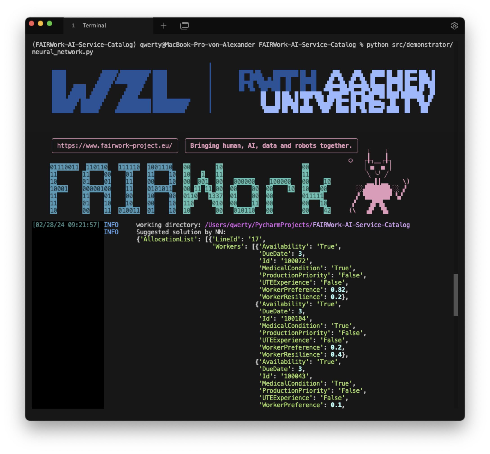

# FAIRWork AI Service Catalogue for the Demonstrator

This repository contains Services, that are integrated into the FAIRWork Demonstrator.
All services are integrated via a REST API endpoints, which is used by the FAIRWork Demonstrator to access the services.


## Setup for REST API (Server side)
1. Clone the repository
2. Install the requirements by running `pip install -r requirements.txt`
3. Install the project into your python environment by running `pip install -e .`
4. Run the REST API by running `python src/rest/production.py`

## Setup for development
Most scripts contain a `if __name__ == "__main__":` block, which can be used to run the script as a standalone script. 
This block showcases the main functionality of the script and can be used to test the script.
In the end all functionality is integrated into the REST API.
For local development the REST API can be run locally.

1. Clone the repository
2. Install the requirements by running `pip install -r requirements_dev.txt` (dev contains the requirements for testing and development)
3. install tox by running `pip install tox`
4. Install the project locally by running `pip install -e .`
5. Run the REST API locally by running `python src/rest/flaskx_endpoints.py`

After following these steps the console output should look like so:


## Swagger-UI

The REST API endpoint is documented using Swagger-UI. 
In the example case `http://127.0.0.1:5000/` will redirect to the Swagger-UI documentation.

The Swagger-UI looks like this:


One can also test the API using the Swagger-UI and perform requests to the API.
The default values represent a valid example request to the API.

## AI Models

### Linear Assignment Solver
The Linear Assignment Solver is an exact solver for the linear assignment problem of the demonstrator.
For running it standalone, the `src/demonstrator/linear_assignment_solver.py` script can be used.
Running the script will solve the linear assignment problem for the example instance (`resources/OutputKB_Final.json`) and print the result to the console.

```python src/demonstrator/linear_assignment_solver.py```


### Neural Network Model
The Neural Network Model is a simple neural network model, that is used to demonstrate the integration of a neural network model into the FAIRWork Demonstrator.
The model is trained on example Input-Output instances and can be used to predict the output for a given input.
For running it standalone, the `src/demonstrator/neural_network_model.py` script can be used.
Running the script will train the model on the example instances and predict the output for the example input.

```python src/demonstrator/neural_network.py```



## Testing

### Unit Tests with `pytest`
Unit tests are implemented using `pytest`. 
To run the tests, run `pytest` in the root directory of the repository.
Note, that you have to install the 'requirements_dev.txt' (`pip install -r requirements_dev.txt`) to run the tests.
The configuration for the tests is located in the `pyproject.toml` file.


### Unit Tests with `tox`
Tox is a generic virtualenv management and test command line tool you can use for checking that your package installs correctly with different Python versions and interpreters.
To run the tests with `tox`, run `tox` in the root directory of the repository.
The configuration for the tests is located in the `tox.ini` file.


### Automated Tests with GitHub Actions
The repository is configured to run the tests automatically with GitHub Actions.
The configuration for the tests is located in the `.github/workflows/test.yml` file.
Automated tests are run on every push to the repository.
It basically runs the `tox` command to run the tests, but i additionally runs it on multiple operating systems.


# FAIRWork Project
Development Repository for AI Services for the FAIRWork Project

“This work has been supported by the FAIRWork project (www.fairwork-project.eu) and has been funded within the European Commission’s Horizon Europe Programme under contract number 101049499. This paper expresses the opinions of the authors and not necessarily those of the European Commission. The European Commission is not liable for any use that may be made of the information contained in this presentation.”

Copyright © RWTH of FAIRWork Consortium
